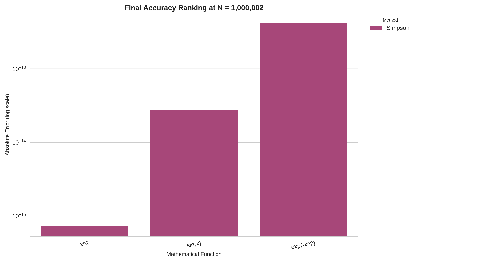
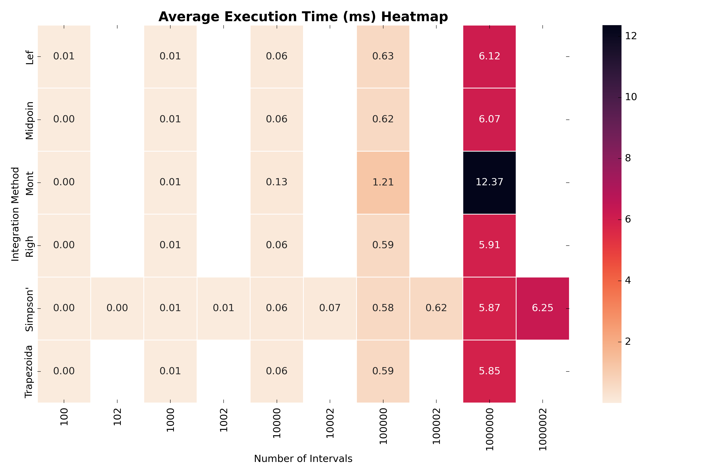

# Comparative Study of Numerical Integration Algorithms in C

This project provides a complete implementation and comparative evaluation of seven well-known numerical integration schemes. The focus is on measuring their **accuracy, convergence order, and computational cost** when applied to representative test functions. Alongside algorithmic development, this work demonstrates practical use of C programming concepts such as **function pointers, structs, and memory management**, with results exported and visualized using Python.

---

## Repository Layout

The source tree is organized to emphasize modularity, reproducibility, and automated visualization.

```
.
├── integration_comparison.csv   # Data generated by the C benchmark program
├── integration_demo             # Compiled C executable
├── integration_techniques.c     # Numerical integration algorithms
├── integration_techniques.h     # Public API (function prototypes, structs)
├── main.c                       # Driver program for experiments
├── plot.py                      # Python plotting script
├── plots/                       # Directory of generated plots
│   ├── 1_convergence_...png
│   └── ...
└── README.md                    # Documentation
```

---

## Mathematical Framework

The central task is to approximate the definite integral

$$
I = \int_a^b f(x)\,dx
$$

by partitioning the interval $[a,b]$ into $N$ subintervals of width

$$
\Delta x = \frac{b-a}{N}, \quad x_i = a + i\Delta x.
$$

Each quadrature rule provides a different approximation formula for $I$. Their effectiveness is judged by **error estimates** of the form

$$
E = I - I_N,
$$

where $I_N$ denotes the numerical approximation.

---

### 1. Rectangle Rules (First-Order)

The simplest approach approximates each subinterval by a constant function.

* **Left endpoint rule**

$$
I_N = \Delta x \sum_{i=0}^{N-1} f(x_i),
$$

with local error proportional to $f'(x)$.

* **Right endpoint rule**

$$
I_N = \Delta x \sum_{i=1}^{N} f(x_i).
$$

**Error:** Both are first-order accurate:

$$
E = \mathcal{O}(\Delta x).
$$

---

### 2. Midpoint Rule

Uses the function value at the center of each interval:

$$
I_N = \Delta x \sum_{i=0}^{N-1} f\!\left(x_i + \tfrac{\Delta x}{2}\right).
$$

**Error:**

$$
E \approx -\frac{(b-a)}{24}\,\Delta x^2 f''(\xi), \quad \xi\in(a,b).
$$

This achieves **second-order convergence**.

---

### 3. Trapezoidal Rule

Approximates each subinterval by a trapezoid:

$$
I_N = \frac{\Delta x}{2}\bigg(f(x_0) + 2\sum_{i=1}^{N-1} f(x_i) + f(x_N)\bigg).
$$

**Error:**

$$
E \approx -\frac{(b-a)}{12}\,\Delta x^2 f''(\xi).
$$

Also second-order, with different constants from midpoint.

---

### 4. Simpson’s 1/3 Rule

Combines pairs of intervals into a quadratic interpolation:

$$
I_N = \frac{\Delta x}{3}\big(f(x_0) + 4f(x_1) + 2f(x_2) + \dots + 4f(x_{N-1}) + f(x_N)\big),
\quad N\ \text{even}.
$$

**Error:**

$$
E \approx -\frac{(b-a)}{180}\,\Delta x^4 f^{(4)}(\xi).
$$

This achieves **fourth-order accuracy**.

---

### 5. Simpson’s 3/8 Rule

Based on cubic interpolation over triples of intervals:

$$
I_N = \frac{3\Delta x}{8}\big(f(x_0) + 3f(x_1) + 3f(x_2) + 2f(x_3) + \dots + 3f(x_{N-1}) + f(x_N)\big),
\quad N \equiv 0 \pmod{3}.
$$

**Error:**

$$
E \approx -\frac{3(b-a)}{80}\,\Delta x^4 f^{(4)}(\xi).
$$

Also fourth-order, though with a larger error constant.

---

### 6. Monte Carlo Method

Formulates the integral as an expectation:

$$
I = (b-a)\,\mathbb{E}[f(U)], \quad U \sim \text{Uniform}(a,b).
$$

Estimated via

$$
I_N = \frac{b-a}{N}\sum_{i=1}^N f(u_i),
$$

where each $u_i$ is sampled randomly.

**Error:** Statistical, not deterministic:

$$
\mathrm{Var}(I_N) = \frac{(b-a)^2}{N}\,\mathrm{Var}(f(U)),
$$

giving convergence of order $\mathcal{O}(N^{-1/2})$.

---

## Error Orders at a Glance

| Method          | Convergence Order   | Error Model                                  |
| --------------- | ------------------- | -------------------------------------------- |
| Rectangle (L/R) | 1                   | $\tfrac{1}{2}(b-a)\Delta x f'(\xi)$          |
| Midpoint        | 2                   | $-\tfrac{(b-a)}{24}\Delta x^2 f''(\xi)$      |
| Trapezoidal     | 2                   | $-\tfrac{(b-a)}{12}\Delta x^2 f''(\xi)$      |
| Simpson’s 1/3   | 4                   | $-\tfrac{(b-a)}{180}\Delta x^4 f^{(4)}(\xi)$ |
| Simpson’s 3/8   | 4                   | $-\tfrac{3(b-a)}{80}\Delta x^4 f^{(4)}(\xi)$ |
| Monte Carlo     | 0.5 (probabilistic) | $\mathcal{O}(1/\sqrt{N})$                    |

---

## Implementation Notes

* **Struct encapsulation**: Parameters (`IntegrationParams`) and results (`IntegrationResult`) stored in structured types.
* **Function pointers**: `typedef double (*MathFunction)(double)` makes the framework generic.
* **Dynamic allocation**: Benchmark arrays allocated with `malloc()` and released with `free()`.
* **CSV export**: Results written to `integration_comparison.csv` for reproducibility.

---

## Experimental Results

### Convergence Plots

Errors plotted on log–log scales confirm theoretical rates:

.png)
.png)
.png)

* Rectangle: slope ≈ 1
* Midpoint/Trapezoidal: slope ≈ 2
* Simpson’s: slope ≈ 4
* Monte Carlo: slope ≈ 0.5

---

### Efficiency vs. Accuracy

Execution time compared to absolute error:

.png)
.png)
.png)

Simpson’s methods dominate the **low-error, low-time** region.

---

### Accuracy Ranking

Final error at largest $N$:



Simpson’s rules outperform others by several orders of magnitude.

---

### Execution Time Analysis

Average runtime per method:



All deterministic rules scale linearly in $N$; Monte Carlo shows slightly higher overhead due to random sampling.

---

## Running the Project

1. **Compile**

   ```bash
   gcc -Wall -Wextra -o integration_demo main.c integration_techniques.c -lm
   ```

2. **Execute**

   ```bash
   ./integration_demo
   ```

   Produces `integration_comparison.csv`.

3. **Visualize**

   ```bash
   pip install pandas matplotlib seaborn
   python plot.py
   ```

   Plots saved in `plots/`.

---

## Conclusion

* **Simpson’s 1/3 Rule** is the most effective for one-dimensional smooth integrals, achieving high accuracy rapidly.
* **Trapezoidal and Midpoint** are serviceable but less efficient.
* **Monte Carlo** converges slowly in 1D, but remains indispensable in higher dimensions.

This comparative study illustrates how both **theoretical error bounds** and **empirical benchmarks** can guide the choice of numerical integration method in practice.
